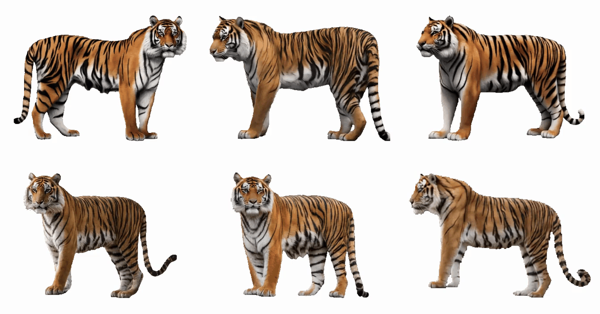
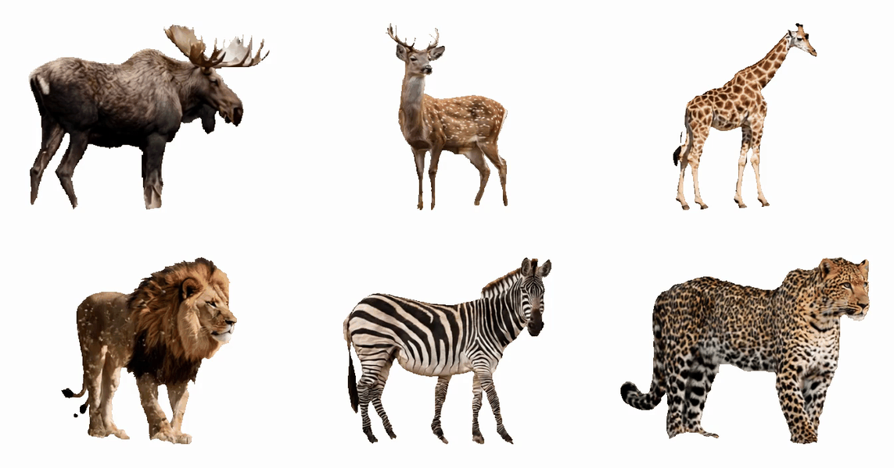

# Syn-Tiger-360: Boosting Tiger Re-ID with 360° Video Generation

**A Generative Synthesis Approach for Wildlife Individual Re-Identification**

### Highlights
- First framework to generate high-fidelity **360° tiger videos** using image-to-video foundation models for wildlife Re-ID.
- Introduces **Syn-Tiger-360**, the first synthetic dataset with **518 full-rotation tiger videos** preserving 3D-consistent stripe patterns.
- Enables training of robust tiger Re-ID models using **purely synthetic data** with **zero additional real-world annotations**.
- Achieves strong real-world performance on actual camera-trap tigers and generalizes to other visually distinctive species.
- Overcomes critical data scarcity in resource-limited conservation areas without large-scale camera-trap deployment.

### Visual Demos

#### Synthetic 360° Tiger Rotations

#### Generalization to Other Species (zebra, giraffe, etc.)

### Download Dataset
The raw video dataset is available in [Google Drive](https://drive.google.com/file/d/1pK4n_eP-g8cGR9JTlH_3kcauN68ZSLbv/view).

If you have any questions, encounter issues, or want to contribute, please feel free to raise an issue! [Open an Issue](https://github.com/qsong/syn-tiger-360/issues/new)

Please also feel free to email me at syn_tiger_360@yeah.net if you have any questions.

### Acknowledgments

Thanks to **[Wan2.1](https://github.com/Wan-Video/Wan2.1)** for their outstanding image-to-video foundation models, and **[Remade-AI]()** for their amazing 360° LoRA adaptations, and to the **[ComfyUI](https://github.com/Comfy-Org/ComfyUI)** community for the powerful workflow platform that enabled large-scale synthetic video generation.

